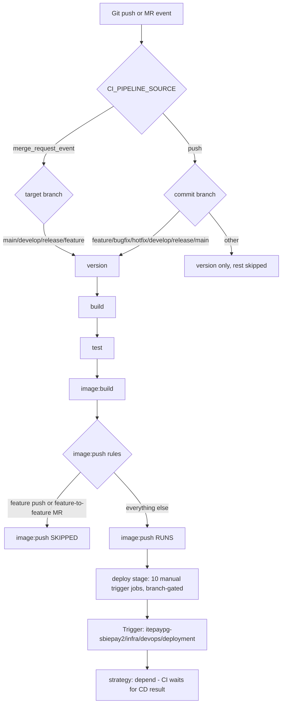
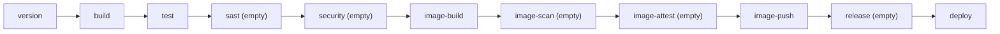
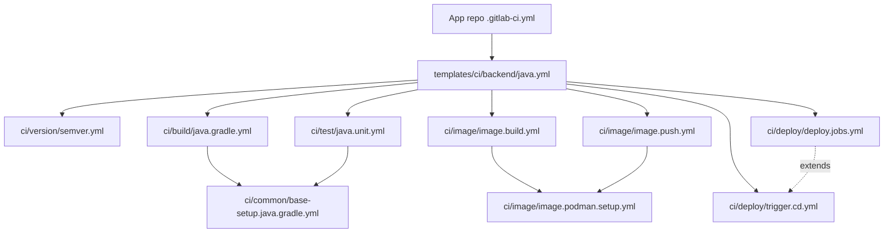
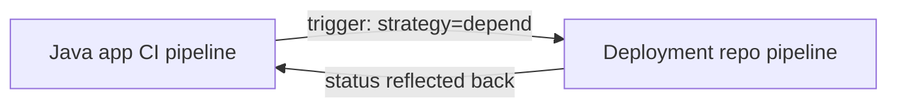
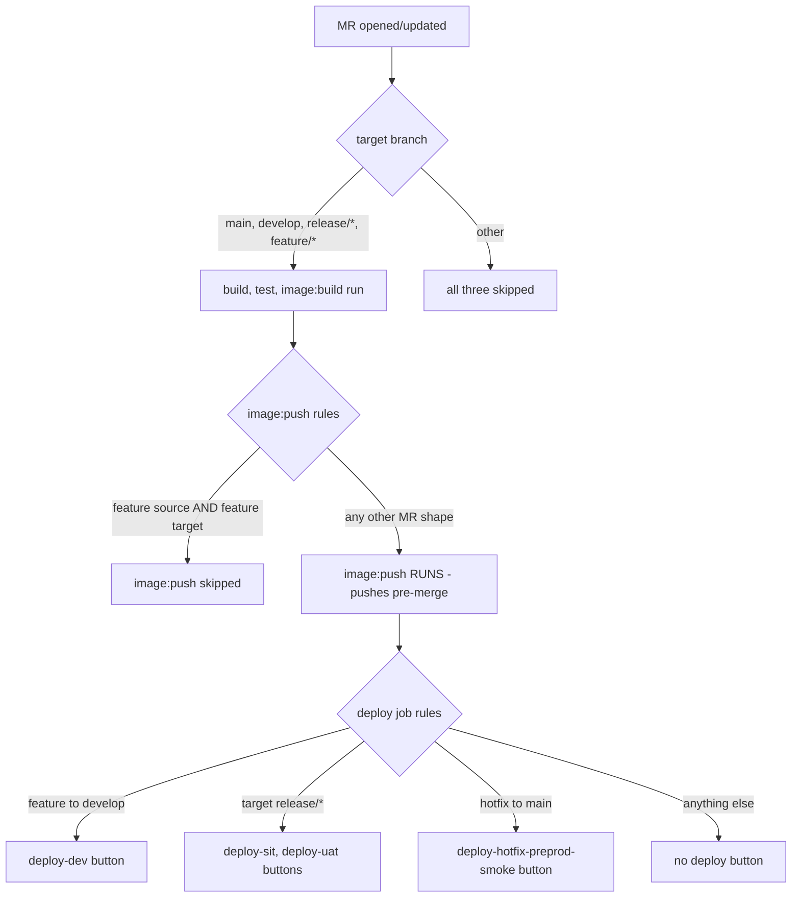
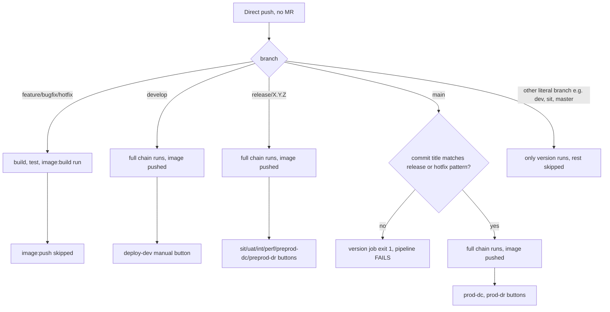
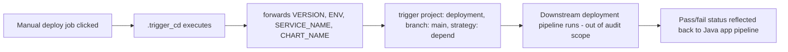

# Java Application CI/CD Pipeline — Technical Audit

**Scope:** `itepaypg-sbiepay2/infra/devops/cicd-templates`, Java microservice path only (`templates/ci/backend/java.yml` and every file it transitively includes).
**Method:** Every claim below is traced to a specific file and line. Where the templates do not define a behavior, this is stated explicitly rather than inferred.
**Out of scope (per instruction):** `java.library.yml`, all non-Java stacks, the CD/deployment repo internals (`templates/cd/*`, `cd/*`) — referenced only at the trigger boundary, since that is where the Java CI pipeline's authority ends.

---

## Step 1 — Repository Structure & Include Hierarchy

### 1.1 Entry point

The Java microservice CI entry point is **`templates/ci/backend/java.yml`**. An application repo's own `.gitlab-ci.yml` includes only this one file:

```yaml
include:
  - project: 'itepaypg-sbiepay2/infra/devops/cicd-templates'
    ref: main
    file: 'templates/ci/backend/java.yml'
```

This is confirmed by `README.md` §6 in the templates repo. No other entry point exists for Java microservices.

### 1.2 What `java.yml` includes (as currently active)

`templates/ci/backend/java.yml`, lines 18–39:

```yaml
include:
  - local: 'ci/version/semver.yml'
  - local: 'ci/build/java.gradle.yml'
  - local: 'ci/test/java.unit.yml'
  # - local: 'ci/security/sast/sast.gitlab.yml'              [commented out]
  # - local: 'ci/security/sast/sast.fortify.yml'              [commented out]
  # - local: 'ci/security/sca/sca.xray.yml'                  [commented out]
  # - local: 'ci/security/secrets/secrets.detect.yml'         [commented out]
  # - local: 'ci/security/iac/iac.scan.yml'                  [commented out]
  # - local: 'ci/security/license/license.scan.yml'           [commented out]
  # - local: 'ci/security/sbom/sbom.generate.yml'             [commented out]
  - local: 'ci/image/image.build.yml'
  # - local: 'ci/image/image.scan.trivy.yml'                  [commented out]
  # - local: 'ci/image/image.scan.xray.yml'                  [commented out]
  # - local: 'ci/image/image.scan.rhacs.yml'                  [commented out]
  # - local: 'ci/image/image.sign.yml'                       [commented out]
  # - local: 'ci/image/image.sbom.attest.yml'                 [commented out]
  - local: 'ci/image/image.push.yml'
  # - local: 'ci/release/tag.yml'                             [commented out]
  # # - local: 'ci/release/back-merge.yml'                    [commented out]
  - local: 'ci/deploy/trigger.cd.yml'
  - local: 'ci/deploy/deploy.jobs.yml'
```

**This is the single most important fact in this audit.** GitLab `include:` is parsed line-by-line; a YAML-commented line is never fetched, never merged, and contributes zero jobs, zero stages, and zero rules to the resolved pipeline. Nine of the seventeen listed includes are commented out. The effective include list resolving today is exactly:

1. `ci/version/semver.yml`
2. `ci/build/java.gradle.yml` → transitively includes `ci/common/base-setup.java.gradle.yml`
3. `ci/test/java.unit.yml` → transitively includes `ci/common/base-setup.java.gradle.yml` (re-included, idempotent — GitLab deduplicates identical includes)
4. `ci/image/image.build.yml` → transitively includes `ci/image/image.podman.setup.yml`
5. `ci/image/image.push.yml` → transitively includes `ci/image/image.podman.setup.yml` (re-included)
6. `ci/deploy/trigger.cd.yml`
7. `ci/deploy/deploy.jobs.yml`

### 1.3 Include / inheritance dependency tree

```
App repo .gitlab-ci.yml
  └─ include: templates/ci/backend/java.yml          [ORCHESTRATOR — Layer 1]
       ├─ include: ci/version/semver.yml              [job: version]
       ├─ include: ci/build/java.gradle.yml            [hidden: .build]
       │    └─ include: ci/common/base-setup.java.gradle.yml  [hidden: .base_setup_java_gradle]
       ├─ include: ci/test/java.unit.yml               [hidden: .test]
       │    └─ include: ci/common/base-setup.java.gradle.yml  (same hidden job, re-included)
       ├─ include: ci/image/image.build.yml            [hidden: .image_build, job: image:build]
       │    └─ include: ci/image/image.podman.setup.yml [hidden: .setup_jfrog_podman]
       ├─ include: ci/image/image.push.yml              [hidden: .image_push, job: image:push]
       │    └─ include: ci/image/image.podman.setup.yml (same hidden job, re-included)
       ├─ include: ci/deploy/trigger.cd.yml             [hidden: .trigger_cd]
       └─ include: ci/deploy/deploy.jobs.yml            [jobs: deploy-dev, deploy-sit, deploy-uat,
                                                           deploy-int, deploy-perf, deploy-preprod-dc,
                                                           deploy-preprod-dr, deploy-hotfix-preprod-smoke,
                                                           deploy-prod-dc, deploy-prod-dr]
            (all 10 jobs extend .trigger_cd from trigger.cd.yml above)

NOT included (commented out — contribute nothing to the resolved pipeline):
  ci/security/sast/sast.gitlab.yml
  ci/security/sast/sast.fortify.yml
  ci/security/sca/sca.xray.yml
  ci/security/secrets/secrets.detect.yml
  ci/security/iac/iac.scan.yml
  ci/security/license/license.scan.yml
  ci/security/sbom/sbom.generate.yml
  ci/image/image.scan.trivy.yml
  ci/image/image.scan.xray.yml
  ci/image/image.scan.rhacs.yml
  ci/image/image.sign.yml
  ci/image/image.sbom.attest.yml
  ci/release/tag.yml
  ci/release/back-merge.yml
```

### 1.4 Parent/child pipelines, dynamic pipelines

There is **no `trigger: include:` (child pipeline)** construct anywhere in the active Java include chain. The only `trigger:` keyword in scope is in `ci/deploy/trigger.cd.yml` (`.trigger_cd`), and that is a **multi-project trigger**, not a parent/child (same-project) pipeline:

```yaml
.trigger_cd:
  stage: deploy
  trigger:
    project: "itepaypg-sbiepay2/infra/devops/deployment"
    branch:  "$DEPLOYMENT_BRANCH"
    strategy: depend
    forward:
      pipeline_variables: true
      yaml_variables: true
```

`strategy: depend` means the upstream (Java app) pipeline job waits for the downstream (deployment repo) pipeline to finish and reflects its pass/fail status. This is the *only* cross-pipeline relationship in the Java CI path. The deployment repo's own pipeline definition (`templates/cd/*.yml`) is out of scope per the brief, but its existence as a triggered downstream pipeline is a structural fact worth recording: **the CI pipeline never deploys anything itself — it only triggers a separate pipeline in a separate project and waits.**

No `rules: changes:` dynamic-include pattern, no `workflow:rules:` driven conditional include, and no `generate-config`-style dynamic child pipeline exist anywhere in this repository.

### 1.5 Folder purpose summary

| Folder | Purpose | Relevant to Java path? |
|---|---|---|
| `templates/ci/backend/` | Orchestrators (Layer 1) — what app repos include | Yes — `java.yml` is the entry point |
| `ci/version/` | Computes `VERSION` string | Yes — `semver.yml` |
| `ci/build/` | Stack-specific build jobs | Yes — `java.gradle.yml` |
| `ci/common/` | Shared hidden base jobs (image, before_script) | Yes — `base-setup.java.gradle.yml` |
| `ci/test/` | Stack-specific test jobs | Yes — `java.unit.yml` |
| `ci/security/sast,sca,secrets,iac,license,sbom/` | Security scanning jobs | **Defined but not included today** |
| `ci/image/` | Container build/scan/sign/push jobs | Partially — only `image.build.yml` + `image.push.yml` active |
| `ci/release/` | Git tagging, back-merge automation | **Defined but not included today** |
| `ci/deploy/` | CD trigger jobs | Yes — `trigger.cd.yml` + `deploy.jobs.yml` |
| `templates/cd/`, `cd/` | Deployment-repo-side templates | Out of scope — downstream pipeline only |
| `compliance/`, `security/dast`, `security/fuzz`, `ops/` | Group-level / scheduled pipelines | Not part of per-commit Java CI flow |

---

## Step 2 — Complete Execution Flow

```
Developer Action (git push / MR create / MR merge)
        │
        ▼
GitLab Event (CI_PIPELINE_SOURCE = "push" | "merge_request_event")
        │
        ▼
Workflow Rules
        │   NONE DEFINED. No workflow: block exists anywhere in the Java
        │   include chain or at any ancestor. GitLab's built-in default
        │   workflow rules apply (pipeline created for both push and MR
        │   events, with GitLab's standard duplicate-pipeline prevention
        │   for branches with open MRs).
        ▼
Pipeline Creation (always — gating happens at job-level `rules:`, not workflow-level)
        │
        ▼
Included Templates resolved (Section 1.2/1.3 above)
        │
        ▼
Stages (declared in java.yml lines 41-52):
  version → build → test → sast → security → image-build → image-scan →
  image-attest → image-push → release → deploy
        │   NOTE: 4 of these 11 stage NAMES exist in the `stages:` list but
        │   have ZERO jobs assigned to them today (sast, security,
        │   image-scan, image-attest, release) because their job
        │   definitions live in files that are not included. GitLab still
        │   lists them in the pipeline graph as empty/skipped stages.
        ▼
Jobs evaluate `rules:` per-job (java.yml's shared `.rules` anchor for
  build/test/image:build; each deploy job has bespoke rules in
  deploy.jobs.yml; image:push has its own rules)
        │
        ▼
Job execution in dependency order (version → build → test → image:build →
  image:push), each consuming the prior job's `dotenv` artifact
        │
        ▼
Deploy stage: 10 manual/auto trigger jobs become available per branch
  context (Section 6) — clicking one fires `.trigger_cd`
        │
        ▼
Multi-project trigger to itepaypg-sbiepay2/infra/devops/deployment
  (strategy: depend — CI pipeline blocks on and reflects CD result)
        │
        ▼
Verification / Completion
        │   Verification (helm rollout status, /actuator/health) happens
        │   inside the DOWNSTREAM deployment repo pipeline — out of scope
        │   for this audit, and NOT visible as a job in the Java app's
        │   own pipeline graph beyond the single "trigger" bridge job.
        ▼
Completion — Java app pipeline reports pass/fail based on the bridge job's
  reflected status from the deployment pipeline.
```

---

## Step 3 — Stage Analysis

`stages:` block, `templates/ci/backend/java.yml` lines 41–52:

| Stage | Jobs (active today) | Purpose | Runs When | Skipped When | Dependencies |
|---|---|---|---|---|---|
| `version` | `version` | Computes `VERSION` string consumed by every later stage | Every pipeline (`rules: - when: on_success` in `semver.yml` line 222) | Never — unconditional | None |
| `build` | `build` (extends `.build` + `.rules`) | Gradle compile, produces JAR | MR to `main\|develop\|release(/*)?\|feature(/*)?`, OR push to `main\|develop\|release\|hotfix\|bugfix\|feature(/*)?` (java.yml `.rules`, lines 68-78) | Any other branch/source not matching the regex above | `version` (needs `VERSION` from dotenv) |
| `test` | `test` (extends `.test` + `.rules`) | Gradle unit tests | Same `.rules` as `build` | Same as `build` | `build` artifacts (`build/classes/`, `build/resources/`, `build/tmp/`) |
| `sast` | **none** | (Designed for) GitLab SAST + Fortify | N/A — jobs not included | Always — stage is empty | N/A |
| `security` | **none** | (Designed for) SCA, secrets, IaC, license, SBOM scanning | N/A — jobs not included | Always — stage is empty | N/A |
| `image-build` | `image:build` (extends `.image_build` + `.rules`) | `podman build` + `podman save` to local tarball (no push) | Same `.rules` as `build`/`test` | Same as `build` | `build` artifacts (JAR), `version` dotenv |
| `image-scan` | **none** | (Designed for) Trivy/Xray/RHACS scanning | N/A — jobs not included | Always — stage is empty | N/A |
| `image-attest` | **none** | (Designed for) cosign sign + SBOM attestation | N/A — jobs not included | Always — stage is empty | N/A |
| `image-push` | `image:push` (extends `.image_push`, own `rules:`) | `podman load` + `podman push` to JFrog | Default `on_success`, EXCEPT explicitly skipped on feature→feature MR, and direct push to `feature/*`, `bugfix/*`, `hotfix/*` (image.push.yml lines 31-46) | The three explicit `when: never` conditions above | `image:build` artifacts (the `.tar`), `version` dotenv |
| `release` | **none** | (Designed for) RC tag / prod tag creation | N/A — jobs not included | Always — stage is empty | N/A |
| `deploy` | `deploy-dev`, `deploy-sit`, `deploy-uat`, `deploy-int`, `deploy-perf`, `deploy-preprod-dc`, `deploy-preprod-dr`, `deploy-hotfix-preprod-smoke`, `deploy-prod-dc`, `deploy-prod-dr` (all extend `.trigger_cd`) | Trigger downstream deployment-repo pipeline for a specific environment | Per-job, branch/MR-specific (Section 6) | Per-job `when: never` fallback in every job's `rules:` | `image:push` (implicitly, by pipeline stage order — no explicit `needs:`) |

**Important nuance on `image:build` and `image:push` dependency:** Neither job declares an explicit `needs:` block. GitLab therefore falls back to **stage-order dependency** — `image:push` runs only after the entire `image-build` stage (and every stage before it) completes successfully, and `image:push` downloads artifacts from *all* prior jobs in the pipeline by default (not just `image:build`), since no `dependencies:` restriction is set either. This is functionally correct here because there is only one image-build job, but it is worth flagging as implicit rather than explicit linkage (see Step 14, Observations).

---

## Step 4 — Job Analysis

### 4.1 `version`
*Source: `ci/version/semver.yml`*

| Property | Value |
|---|---|
| Template used | None — top-level job, not extended from elsewhere |
| extends | None |
| image | `artifactory.jfrog.sbi:443/itepaypg-sbiepay2-docker-local/custom-ci/rhelgit-oc-helm:1.0` |
| variables | `GIT_DEPTH: "0"` (full clone — required for accurate RC tag counting) |
| before_script | `git config --global http.sslVerify false`; `git config --global --add safe.directory '*'` |
| script | Branch/pipeline-source-dependent VERSION computation (full logic in §4.1.1 below) |
| artifacts | `reports.dotenv: version.env`, `expire_in: 1 day` |
| cache | None defined |
| retry | None defined (defaults to 0 — no auto-retry) |
| needs | None (no `needs:` block — runs as soon as stage order allows, no upstream dependency) |
| dependencies | Not restricted (default: all prior, but `version` is first, so moot) |
| allow_failure | Not set (default: `false` — pipeline fails if `version` fails) |
| interruptible | Not set (default: `false`) |
| resource_group | Not set |
| environment | Not set |
| rules | `- when: on_success` (line 222) — unconditional, runs on every pipeline regardless of branch or source |

**4.1.1 VERSION computation logic** (exact branch matrix from the script):

| Context | VERSION pattern |
|---|---|
| `CI_PIPELINE_SOURCE == merge_request_event` | `mr-<src-clean>-<tgt-clean>-<MR_IID>-<short-sha>` |
| push to `feature/*`, `bugfix/*`, `hotfix/*` | `<branch-clean>-<short-sha>` |
| push to `develop` | `dev-<short-sha>` |
| push to `release/X.Y.Z` | `X.Y.Z-rc.N` (N = existing matching tag count + 1) |
| push to `main` | Parses `CI_COMMIT_TITLE` for `release/X.Y.Z` or `hotfix/X.Y.Z` pattern → uses `X.Y.Z`. **If the merge commit title does not match this pattern (e.g., a squash/rebase merge was used), the job exits 1 and the entire pipeline fails** (lines 176-185 of `semver.yml`) |
| any other branch | Falls back to `<short-sha>` with a warning |

### 4.2 `build`
*Source: `ci/build/java.gradle.yml`, base from `ci/common/base-setup.java.gradle.yml`*

| Property | Value |
|---|---|
| Template used | `.build`, extends `.base_setup_java_gradle` |
| extends hierarchy | `build` job → `.build` (java.gradle.yml) → `.base_setup_java_gradle` (base-setup.java.gradle.yml) |
| image (inherited) | `artifactory.jfrog.sbi:443/itepaypg-sbiepay2-docker-virtual/custom-ci/epay-build-java-gradle:1.0.0` |
| variables (inherited + own) | `CACERT_PATH`, `JFROG_GRADLE_REPO`, `GRADLE_OPTS: -Dorg.gradle.daemon=false`, `GRADLE_USER_HOME` |
| before_script (inherited) | Verifies `java -version`/`gradle --version`; injects `epay-artifactory.init.gradle` via heredoc (routes plugin + dependency resolution through Artifactory, enforces `FAIL_ON_PROJECT_REPOS`); imports JFrog internal CA into a writable cacerts copy; sets `JAVA_TOOL_OPTIONS` to point at custom truststore |
| script | Validates `VERSION` is non-empty (fails fast if `semver.yml` dotenv didn't load); runs `gradle build -x test -Pversion="${VERSION}"`; verifies JAR exists in `build/libs/`; writes `JAR_FILE` and `BUILD_TIME` to `build.env` |
| artifacts | paths: `build/libs/`, `build/classes/`, `build/resources/`, `build/tmp/`; `reports.dotenv: build.env`; `when: on_success` (default); `expire_in: 1 day` |
| cache | None defined — every build resolves dependencies fresh from Artifactory (documented rationale: "JFrog Artifactory on LAN is fast enough for air-gapped environment") |
| retry | None defined |
| needs | None explicit (stage-order dependency on `version`) |
| dependencies | Not restricted |
| allow_failure | Not set (default `false`) |
| interruptible | Not set |
| resource_group | Not set |
| environment | Not set |
| tags | `common_runner` (inherited) |
| rules (java.yml) | `.rules` (shared anchor, see Step 5) |

### 4.3 `test`
*Source: `ci/test/java.unit.yml`, base from `ci/common/base-setup.java.gradle.yml`*

| Property | Value |
|---|---|
| extends hierarchy | `test` job → `.test` (java.unit.yml) → `.base_setup_java_gradle` (same base as build) |
| image/before_script | Identical to `build` (shared base) |
| script | Runs `gradle test`. Because `build/classes/`, `build/resources/`, `build/tmp/` are present from the `build` job's artifacts, Gradle's incremental-build detection skips `compileJava`, `compileTestJava`, `processResources`, `processTestResources` — only the `test` task actually executes. The init script still runs (Initialization + Configuration phases are unconditional in Gradle) |
| artifacts | paths: `build/reports/tests/test/` (HTML report); `reports.junit: build/test-results/test/TEST-*.xml` (native GitLab MR test summary); **`when: always`** — uploaded even on test failure, for failure analysis; `expire_in: 1 day` |
| needs | None explicit — relies on stage order placing `test` after `build`, and on `build`'s artifacts being available by default (no `dependencies:` restriction) |
| rules (java.yml) | `.rules` (shared anchor — identical condition set to `build`) |
| Other properties | Same defaults as `build` (no retry, no resource_group, no environment, `allow_failure` defaults false) |

### 4.4 `image:build`
*Source: `ci/image/image.build.yml`, base from `ci/image/image.podman.setup.yml`*

| Property | Value |
|---|---|
| extends hierarchy | `image:build` → `.image_build` (image.build.yml) → `.setup_jfrog_podman` (image.podman.setup.yml) |
| image (inherited) | `artifactory.jfrog.sbi:443/dso-docker-base-images/ubi9/podman-jf:9.7` |
| before_script (inherited) | Configures podman registry trust (copies `$ARTIFACTORY_CERT` to `/etc/containers/certs.d/`), system trust store, JFrog CLI cert trust, `podman login`, `jf config add`/`jf config use` |
| script | Detects build output type (`build/libs` for backend Java, with fallback branches for frontend/python/php that are irrelevant here since this job only runs from `java.yml`); computes `COMPUTED_IMAGE_TAG = $CI_TEMPLATE_REGISTRY_HOST/$IMAGE_NAME:$VERSION`; runs `podman build --tls-verify=false` with `ENV`, `VERSION`, `BASE_IMAGE_DEV_ENV` build-args; **saves the image to a local `.tar` via `podman save` — does NOT push** |
| artifacts | paths: `*.tar`; `reports.dotenv: image.env` (carries `TAG`, `COMPUTED_IMAGE_TAG`, `TAR_NAME` forward); `expire_in: 1 day` |
| allow_failure | Explicitly set to `false` (line 11 of image.build.yml) |
| needs | None explicit |
| rules (java.yml) | `.rules` (shared anchor) |
| Other properties | No cache, no retry, no resource_group, no environment defined |

### 4.5 `image:push`
*Source: `ci/image/image.push.yml`, base from `ci/image/image.podman.setup.yml`*

| Property | Value |
|---|---|
| extends hierarchy | `image:push` → `.image_push` (image.push.yml) → `.setup_jfrog_podman` |
| image/before_script (inherited) | Identical setup to `image:build` (same shared base) |
| script | `podman load -i "$TAR_NAME"` (re-hydrates the tarball produced by `image:build`); `podman push "$IMAGE_REF" --tls-verify=false`; writes `PUSHED_IMAGE` to `push.env` |
| artifacts | `reports.dotenv: push.env`; `expire_in: 1 week` |
| allow_failure | Explicitly `false` |
| needs | A `needs: - job: image:sign` block exists in the file but is **entirely commented out** (lines 25-27). Since `image:sign` is not even included in the active pipeline, this commented block is inert either way — but its presence documents original intent: push was meant to be gated on signing |
| rules | **Own bespoke `rules:` block, not the shared `.rules` anchor** — see Step 5.5 |
| Other properties | No cache, no retry, no resource_group, no environment |

### 4.6 Deploy-stage jobs (10 jobs, `ci/deploy/deploy.jobs.yml`)

All ten extend `.trigger_cd` from `ci/deploy/trigger.cd.yml`:

```yaml
.trigger_cd:
  stage: deploy
  variables:
    DEPLOYMENT_BRANCH: "main"
    SERVICE_NAME: "${CI_PROJECT_NAME}"
    VERSION: "${VERSION}"
  trigger:
    project: "itepaypg-sbiepay2/infra/devops/deployment"
    branch:  "$DEPLOYMENT_BRANCH"
    strategy: depend
    forward:
      pipeline_variables: true
      yaml_variables: true
```

Per-job specifics:

| Job | `ENV` | `when` (job-level default, overridden by `rules:`) | `allow_failure` | Notes |
|---|---|---|---|---|
| `deploy-dev` | `dev` | manual (both MR and post-merge paths) | not set at job level (rules don't set it either → default `false`) | See exact rule logic, Step 5.6 |
| `deploy-sit` | `sit` | manual | `true` (set inside each rule) | |
| `deploy-uat` | `uat` | manual | `true` | |
| `deploy-int` | `int` | manual | `true` | |
| `deploy-perf` | `perf` | manual | `true` | |
| `deploy-preprod-dc` | `pre-prod-dc` | manual (job-level `when: manual` AND rule-level) | `true` | |
| `deploy-preprod-dr` | `pre-prod` | manual | `true` | Comment in file notes `ENV` was previously missing the `-dr` suffix and was "fixed" to `pre-prod` — worth confirming this is intentional, since it now matches the same `ENV` value as `deploy-hotfix-preprod-smoke` |
| `deploy-hotfix-preprod-smoke` | `pre-prod` | manual | `true` | Only fires on MR pipeline (`hotfix/* → main`), **before** merge |
| `deploy-prod-dc` | `prod-dc` | manual | `true` | |
| `deploy-prod-dr` | `prod-dr` | manual | `true` | |

None of the 10 deploy jobs define `cache`, `retry`, `resource_group`, or `environment:` blocks. **The absence of `environment:` on every deploy job is itself a documented finding** — it was identified in your prior memory context as the root cause of the manual-deploy-button-greyed-out issue, because GitLab's permission check for a manual job without an `environment:` key falls back to the user's role on the *triggering* project, not any downstream Protected Environment.

---

## Step 5 — Rules Evaluation (Complete Logic)

### 5.1 Workflow-level rules

**Finding: no `workflow:` block exists anywhere in the Java include chain or in any file it transitively pulls in.** Confirmed by repository-wide search — the only `workflow:` blocks in the entire `cicd-templates` repository are in `templates/cd/deploy.single.yml` and `cd/helm/helm.deploy.yml`, both of which are **deployment-repo-side templates**, never included by `templates/ci/backend/java.yml`. Therefore GitLab's standard default workflow behavior applies unmodified: a pipeline is created for every push and every merge-request event, subject only to GitLab's built-in duplicate-pipeline avoidance (a branch with an open MR targeting it does not also get a redundant branch-push pipeline for the same commit, by GitLab's native behavior, not anything configured here).

### 5.2 The shared `.rules` anchor (java.yml, lines 68-78)

```yaml
.rules:
  rules:
    # - if: '$CI_PIPELINE_SOURCE == "merge_request_event" && $CI_MERGE_REQUEST_TARGET_BRANCH_NAME =~ /^(main|develop|release)(\/.*)*$/'
    - if: '$CI_PIPELINE_SOURCE == "merge_request_event" &&
            (
              $CI_MERGE_REQUEST_TARGET_BRANCH_NAME =~ /^(main|develop|release)(\/.*)*$/
              ||
              $CI_MERGE_REQUEST_TARGET_BRANCH_NAME =~ /^feature(\/.*)*$/
            )'
    - if: '$CI_COMMIT_BRANCH =~ /^(main|develop|release|hotfix|bugfix|feature)(\/.*)*$/'
    - when: never
```

This anchor is used by `build`, `test`, and `image:build` only (each via `extends: [.build|.test|.image_build, .rules]`). Note line 70 is a **commented-out earlier version** of the same rule, kept inline for history — it is dead weight, not active logic (see Step 14).

**Resolved logic, evaluated top to bottom, first match wins:**

```
IF pipeline_source == "merge_request_event"
    ↓
    IF target_branch matches ^(main|develop|release)(/.*)* 
       OR target_branch matches ^feature(/.*)*
        → JOB RUNS
    ELSE
        ↓ (fall through to next rule)
IF commit_branch matches ^(main|develop|release|hotfix|bugfix|feature)(/.*)*
    → JOB RUNS
ELSE
    → when: never (JOB SKIPPED)
```

**Practical consequence:** any MR whose target is `main`, `develop`, `release/*`, or `feature/*` triggers `build`/`test`/`image:build`. Any direct push to `main`, `develop`, `release/*`, `hotfix/*`, `bugfix/*`, or `feature/*` triggers them too. An MR targeting some other branch name (e.g., a typo'd branch, or a branch outside this taxonomy) skips all three jobs — and by extension, since `version` runs unconditionally but `build`/`test`/`image:build` would not, the pipeline would show `version` passing and three skipped jobs with no error surfaced.

### 5.3 No `only`/`except` keywords present

The entire active Java include chain uses exclusively the modern `rules:` keyword. No legacy `only:`/`except:` blocks exist in any included file (a deprecated pattern from older GitLab CI syntax) — this repository is consistently modern in that respect.

### 5.4 No `changes:` or `exists:` conditions

No job in the active Java path gates on file-path `changes:` or `exists:` checks. Every job's execution depends solely on `$CI_PIPELINE_SOURCE`, `$CI_COMMIT_BRANCH`, `$CI_MERGE_REQUEST_TARGET_BRANCH_NAME`, and `$CI_MERGE_REQUEST_SOURCE_BRANCH_NAME`. This means **the pipeline runs the full active chain on every qualifying push/MR regardless of which files actually changed** — a docs-only commit to `develop` triggers the same `build → test → image:build → image:push` sequence as a code change.

### 5.5 `image:push` — bespoke rules (not the shared anchor)

```yaml
image:push:
  extends: .image_push
  rules:
    - if: '$CI_PIPELINE_SOURCE == "merge_request_event" &&
            $CI_MERGE_REQUEST_SOURCE_BRANCH_NAME =~ /^feature\/.*$/ &&
            $CI_MERGE_REQUEST_TARGET_BRANCH_NAME =~ /^feature\/.*$/'
      when: never
    - if: '$CI_PIPELINE_SOURCE == "push" && $CI_COMMIT_BRANCH =~ /^feature\/.*$/'
      when: never
    - if: '$CI_PIPELINE_SOURCE == "push" && $CI_COMMIT_BRANCH =~ /^bugfix\/.*$/'
      when: never
    - if: '$CI_PIPELINE_SOURCE == "push" && $CI_COMMIT_BRANCH =~ /^hotfix\/.*$/'
      when: never
    - when: on_success
```

```
IF MR source AND target both match feature/* → SKIP
ELSE IF direct push to feature/* → SKIP
ELSE IF direct push to bugfix/* → SKIP
ELSE IF direct push to hotfix/* → SKIP
ELSE → RUNS (on_success — default, no manual gate)
```

**Critical gap identified here:** this job's rules only consider `$CI_COMMIT_BRANCH` for the skip conditions on `feature/bugfix/hotfix` — they do not separately re-check `$CI_PIPELINE_SOURCE == "merge_request_event"` for an MR *targeting* `develop`, `release/*`, or `main` from a feature/bugfix/hotfix source. Since `image:push`'s own `.rules` (the bespoke block above, not the shared `.rules` anchor) doesn't restrict MR pipelines to specific targets at all beyond the one feature→feature exclusion, **an MR opened from `feature/x` into `develop` (or from `hotfix/x` into `main`, or `release/x.y.z` into `main`) will push an image to the registry on the MR pipeline itself, before merge** — because the final catch-all `when: on_success` applies, and the only `merge_request_event` skip condition is feature→feature. This is a meaningful difference from `build`/`test`/`image:build`, whose shared `.rules` anchor allows MR-triggered runs too but for a more deliberately scoped target-branch set. The two rule sets (`.rules` vs `image:push`'s own) are not symmetric — this is flagged again in Step 14.

### 5.6 `deploy-dev` — exact resolved logic

```yaml
deploy-dev:
  rules:
    - if: '$CI_PIPELINE_SOURCE == "merge_request_event" && 
           $CI_MERGE_REQUEST_SOURCE_BRANCH_NAME =~ /^feature\/.*$/ && 
           $CI_MERGE_REQUEST_TARGET_BRANCH_NAME == "develop"'
      when: manual
    - if: '$CI_PIPELINE_SOURCE == "push" && 
           $CI_COMMIT_BRANCH == "develop"'
      when: manual
    - when: never
```

```
IF MR source matches feature/* AND target == "develop" → manual button appears
ELSE IF direct push (post-merge) to "develop" → manual button appears
ELSE → never (no button)
```

Both paths are `when: manual` (no auto-deploy exists today, despite the README's stage table documenting `deploy-dev` as "auto" — see Step 14 for this documentation/implementation mismatch). The job's commented-out lines 28-35 show an earlier version that *did* include an automatic `when: on_success` path for `develop` push — that auto-deploy behavior is currently disabled.

### 5.7 `deploy-sit` / `deploy-uat` — identical resolved logic

```
IF direct push to release/X.Y.Z (semver pattern) → manual button, allow_failure: true
ELSE IF MR targeting release/* → manual button, allow_failure: true
ELSE → never
```

### 5.8 `deploy-int` / `deploy-perf` / `deploy-preprod-dc` / `deploy-preprod-dr` — identical resolved logic

```
IF direct push to release/X.Y.Z (semver pattern) → manual button, allow_failure: true
ELSE → never
```
(No MR-pipeline path for these four — only a post-merge push to `release/*` unlocks them, unlike `deploy-sit`/`deploy-uat` which also unlock on the MR pipeline itself.)

### 5.9 `deploy-hotfix-preprod-smoke` — exact resolved logic

```
IF pipeline_source == merge_request_event 
   AND target_branch == "main" 
   AND source_branch matches ^hotfix/
    → manual button, allow_failure: true
ELSE → never
```

This is the only deploy job whose rule is scoped to the MR pipeline exclusively — it never appears on a post-merge push pipeline, by design (smoke-test before the hotfix actually lands on `main`).

### 5.10 `deploy-prod-dc` / `deploy-prod-dr` — identical resolved logic

```
IF direct push to "main" → manual button, allow_failure: true
ELSE → never
```

Neither has an MR-pipeline path — both require the merge to already be on `main` before the button appears.

### 5.11 Manual jobs summary

Every single job in the `deploy` stage is `when: manual`. **There are zero fully-automatic deployments anywhere in this pipeline today**, including to DEV — every environment, from `dev` through `prod-dr`, requires a human to click a button. (This contradicts the README's stage table, which lists `deploy-dev` as "auto" — see Step 14.)

### 5.12 No delayed jobs

No job anywhere in the active include chain uses `when: delayed` or a `start_in:` value. This keyword does not appear in the repository.

---

## Step 6 — Branch-wise Execution Matrix

This matrix assumes a **direct push** to each branch (MR behavior is in Step 7). "—" means not applicable / no job exists for that category in the active pipeline.

| Branch | Pipeline created? | `version` | `build`/`test` | `image:build` | `image:push` | Deploy buttons unlocked | SAST/SCA/Secrets | Image scan/sign/SBOM | Git tag | Back-merge |
|---|---|---|---|---|---|---|---|---|---|---|
| `feature/*` | Yes | Runs | Runs (`.rules` matches) | Runs (`.rules` matches) | **Skipped** (explicit `when: never`) | None | — (not included) | — (not included) | — (not included) | — (not included) |
| `bugfix/*` | Yes | Runs | Runs | Runs | **Skipped** (explicit `when: never`) | None | — | — | — | — |
| `hotfix/*` | Yes | Runs | Runs | Runs | **Skipped** (explicit `when: never`) | None | — | — | — | — |
| `develop` | Yes | Runs | Runs | Runs | Runs (no skip condition for `develop`) | `deploy-dev` (manual) | — | — | — | — |
| `release/X.Y.Z` | Yes | Runs (computes `X.Y.Z-rc.N`) | Runs | Runs | Runs | `deploy-sit`, `deploy-uat`, `deploy-int`, `deploy-perf`, `deploy-preprod-dc`, `deploy-preprod-dr` (all manual) | — | — | — | — |
| `main` | Yes | Runs (requires merge-commit title to match `release/X.Y.Z` or `hotfix/X.Y.Z`, else **pipeline fails**) | Runs | Runs | Runs | `deploy-prod-dc`, `deploy-prod-dr` (manual) | — | — | — | — |
| `dev` (literal branch name, not the `dev` environment) | Yes — but falls into the "any other branch" case | Runs (uses fallback `<short-sha>` VERSION — no named case for literal branch `dev`) | **Skipped** (`.rules` regex does not include literal `dev`) | **Skipped** | **Skipped** (image:push rules also don't reference it, but image:build never ran so there's no tarball to load — push would fail if somehow reached) | None | — | — | — | — |
| `sit` (literal branch) | Yes — falls into "any other branch" | Runs (fallback VERSION) | **Skipped** | **Skipped** | **Skipped** | None | — | — | — | — |
| `uat` (literal branch) | Yes — falls into "any other branch" | Runs (fallback) | **Skipped** | **Skipped** | **Skipped** | None | — | — | — | — |
| `preprod` (literal branch) | Yes — falls into "any other branch" | Runs (fallback) | **Skipped** | **Skipped** | **Skipped** | None | — | — | — | — |
| `master` | Yes — falls into "any other branch" (the templates only recognize `main`, never `master`) | Runs (fallback `<short-sha>` — the `main`-specific commit-title parsing logic does NOT trigger for a branch literally named `master`) | **Skipped** | **Skipped** | **Skipped** | None | — | — | — | — |
| `production` | Yes — falls into "any other branch" | Runs (fallback) | **Skipped** | **Skipped** | **Skipped** | None | — | — | — | — |

**Explicit finding:** the templates recognize exactly six branch *patterns* for CI purposes: `feature/*`, `bugfix/*`, `hotfix/*`, `develop`, `release/*`, `main`. Any other literal branch name — including ones that sound like they should be meaningful in a DevOps context (`dev`, `sit`, `uat`, `preprod`, `master`, `production`) — receives only the unconditional `version` job and nothing else, because they don't match any regex in `.rules`, `semver.yml`'s branch-matching chain, or any deploy job's `rules:`. This is not a bug per se (those are environment names, not branch names, in this architecture — `release/*` is the single branch that fans out to `sit`/`uat`/`int`/`perf`/`preprod` *environments* via manual deploy buttons) but it is worth stating explicitly since the brief asked about each of these literal branch names.

---

## Step 7 — Merge Request Behaviour Matrix

| MR (source → target) | Pipeline type | `build`/`test`/`image:build` run? | `image:push` run? | Deploy buttons | Notes |
|---|---|---|---|---|---|
| `feature/* → feature/*` | MR pipeline | Runs (`.rules` matches: target matches `^feature(/.*)*`) | **Skipped** (explicit `when: never` for feature→feature) | None | Unusual topology but technically supported by the regex |
| `feature/* → develop` | MR pipeline | Runs (target matches `develop` in `.rules`) | **Runs** — no skip condition in `image:push`'s bespoke rules covers this MR shape; falls through to `when: on_success` | `deploy-dev` (manual) | **Flagged in Step 5.5 — image is pushed to registry on the MR pipeline, before merge** |
| `bugfix/* → release/X.Y.Z` | MR pipeline | Runs (target matches `^release`) | **Runs** (same reasoning — no skip condition matches) | `deploy-sit`, `deploy-uat` (manual, via the MR-targeting-release rule) | Image pushed pre-merge |
| `feature/* → main` | MR pipeline | Runs (target matches `^main`) | **Runs** | None (no deploy job's rules match `target == main` on an MR pipeline except the hotfix-specific one) | Architecturally unusual path (feature direct to main) but not blocked by any rule |
| `release/X.Y.Z → main` | MR pipeline | Runs | **Runs** | None directly — prod deploy jobs require push to `main`, not the MR pipeline itself | Image pushed pre-merge; prod buttons appear only after merge |
| `hotfix/* → main` | MR pipeline | Runs (target matches `^main`) | **Runs** | `deploy-hotfix-preprod-smoke` (manual — the only deploy job scoped to this exact MR shape) | Smoke test available before merge |
| `main → production` (or any MR with `main` as source) | MR pipeline | Runs **only if** target also matches the `.rules` regex set (`main\|develop\|release\|feature`) — `production` does not, so **skipped** | **Skipped** for the same reason (`image:push` rules don't explicitly block this, but `image:build` never produced a tarball, so the load step would fail if reached — moot since `image:push`'s `when: on_success` catch-all is unreachable without `image:build` artifacts present) | None | `production` is not a recognized target branch anywhere in the templates |

**General MR rule recap:** Whether `build`/`test`/`image:build` run on an MR pipeline depends entirely on `$CI_MERGE_REQUEST_TARGET_BRANCH_NAME` matching `^(main|develop|release)(/.*)*$` or `^feature(/.*)*$` — the **source** branch is irrelevant to this gate. Whether `image:push` runs depends on the narrower, asymmetric rule set in Step 5.5, which only explicitly blocks feature→feature MRs.

---

## Step 8 — Post-Merge Behaviour

| Target branch merged into | New pipeline created? | Stages executed | Deployment trigger available | Verification | Notes |
|---|---|---|---|---|---|
| `develop` (feature/* merged) | Yes — `push` pipeline on `develop` | `version → build → test → image-build → image-push` | `deploy-dev` becomes clickable (manual) | Out of scope (downstream pipeline) | No automated deploy — someone must click |
| `release/X.Y.Z` (bugfix/* merged) | Yes — `push` pipeline on `release/X.Y.Z` | Same chain; `VERSION` becomes a new auto-incremented RC | `deploy-sit` through `deploy-preprod-dr` become clickable | Out of scope | RC tag would be created here if `tag.yml` were included — **it is not**, so no git tag is created despite the version string implying one |
| `main` (release/X.Y.Z merged) | Yes — `push` pipeline on `main` | Same chain; `VERSION` parses the merge-commit title for `release/X.Y.Z` | `deploy-prod-dc`, `deploy-prod-dr` become clickable | Out of scope | Prod tag would be created here if `tag.yml` were included — **it is not** |
| `main` (hotfix/* merged) | Yes — `push` pipeline on `main` | Same chain; `VERSION` parses the merge-commit title for `hotfix/X.Y.Z` | `deploy-prod-dc`, `deploy-prod-dr` become clickable | Out of scope | Back-merge to `develop` and active `release/*` branches would fire here if `back-merge.yml` were included — **it is not**, so nothing automatically syncs the hotfix back down |

In every case, "deployment" in this pipeline means exactly one thing: a manual job becomes clickable. No job in the active Java CI path performs an actual deployment action (`helm upgrade`, `oc apply`, etc.) — that logic lives entirely in the downstream deployment-repo pipeline, outside this audit's scope.

---

## Step 9 — Direct Commit (Push, No MR) Behaviour

This duplicates Step 6's matrix but framed explicitly per the brief's structure, with the image/scan/helm/child-pipeline columns called out individually as requested.

| Branch | Pipeline created? | Stages executed | Image built? | Image pushed? | Helm deployment executed? | Child pipeline executed? | Scans executed? |
|---|---|---|---|---|---|---|---|
| `feature/*` | Yes | version, build, test, image-build | Yes (local tarball only) | **No** (explicit skip) | No (deploy stage never reached — no rule unlocks any deploy job for direct feature push) | No — none exist in this repo | No (sast/security stages empty) |
| `develop` | Yes | version, build, test, image-build, image-push | Yes | **Yes** | Not by this pipeline — only a manual trigger to the downstream deployment pipeline becomes available (multi-project trigger, not a same-project child pipeline) | No | No |
| `dev` (literal) | Yes | version only | No | No | No | No | No |
| `sit` (literal) | Yes | version only | No | No | No | No | No |
| `release/X.Y.Z` | Yes | version, build, test, image-build, image-push | Yes | Yes | Manual trigger jobs unlocked for SIT/UAT/INT/PERF/preprod-DC/preprod-DR | No | No |
| `main` | Yes (provided commit title matches expected pattern, else pipeline fails at `version` stage) | version, build, test, image-build, image-push | Yes | Yes | Manual trigger jobs unlocked for prod-DC/prod-DR | No | No |
| `production` (literal) | Yes | version only | No | No | No | No | No |

"Helm deployment executed" and "child pipeline executed" are **No across every single row** in the Java app's own pipeline — these only happen, if at all, inside the separate downstream `itepaypg-sbiepay2/infra/devops/deployment` project, which is outside this audit's scope and which this pipeline only *triggers and waits on*.

---

## Step 10 — Pipeline Decision Tree (ASCII)

```
Git event (push or MR action)
  │
  ├─ No workflow: block exists → GitLab default workflow applies
  │  → Pipeline is ALWAYS created (push or MR), full stop.
  │  (Job-level rules: do all the real gating from here.)
  │
  ▼
CI_PIPELINE_SOURCE?
  │
  ├── "merge_request_event"
  │     │
  │     ▼
  │   CI_MERGE_REQUEST_TARGET_BRANCH_NAME?
  │     │
  │     ├── matches ^(main|develop|release)(/.*)*  → build/test/image:build RUN
  │     ├── matches ^feature(/.*)*                  → build/test/image:build RUN
  │     └── anything else (e.g. production, sit)    → build/test/image:build SKIPPED
  │     │
  │     ▼
  │   image:push bespoke rules:
  │     ├── source AND target both ^feature/.*       → SKIPPED
  │     └── everything else (incl. all MR shapes)     → RUNS (on_success, no further gate)
  │     │
  │     ▼
  │   deploy-stage rules (10 jobs, each independently evaluated):
  │     ├── source ^feature/.* AND target == develop  → deploy-dev manual button
  │     ├── target matches ^release/                   → deploy-sit, deploy-uat manual buttons
  │     ├── source ^hotfix/ AND target == main          → deploy-hotfix-preprod-smoke manual button
  │     └── no other MR shape unlocks any deploy job
  │
  └── "push"
        │
        ▼
      CI_COMMIT_BRANCH?
        │
        ├── ^feature/   → build/test/image:build RUN, image:push SKIPPED, no deploy jobs unlock
        ├── ^bugfix/    → build/test/image:build RUN, image:push SKIPPED, no deploy jobs unlock
        ├── ^hotfix/    → build/test/image:build RUN, image:push SKIPPED, no deploy jobs unlock
        ├── develop     → build/test/image:build/image:push ALL RUN, deploy-dev manual button
        ├── ^release/X.Y.Z → ALL RUN, deploy-sit/uat/int/perf/preprod-dc/preprod-dr manual buttons
        ├── main        → version validates commit title format (fails pipeline if mismatched)
        │                  then ALL RUN, deploy-prod-dc/prod-dr manual buttons
        └── anything else (dev, sit, uat, preprod, master, production, ...)
                          → ONLY version runs (fallback VERSION=<short-sha>), everything else SKIPPED
```

---

## Step 11 — Real Execution Scenarios

**Scenario 1 — Developer creates `feature/EPAY-123`, commits, pushes, opens MR to `develop`, merges**

1. Push to `feature/EPAY-123` (no MR yet): pipeline created, `version` (fallback... actually matches `^(feature|bugfix|hotfix)\/` branch case in `semver.yml` → `feature-epay-123-<sha>`), `build`, `test`, `image:build` all run (`.rules` matches push to `feature/*`). `image:push` explicitly skipped (push to `feature/*` skip rule). No deploy jobs unlock.
2. MR opened, `feature/EPAY-123 → develop`: new MR pipeline. `VERSION = mr-feature-epay-123-develop-<IID>-<sha>`. `build`/`test`/`image:build` run (target `develop` matches `.rules`). `image:push` runs — **the MR pipeline pushes an image to the registry before merge**, since no skip condition in `image:push`'s rules covers this MR shape. `deploy-dev` manual button appears on this MR pipeline.
3. MR merged → `push` pipeline on `develop`. `VERSION = dev-<sha>` (new short-SHA of the merge commit). Full chain runs again, image pushed again (a *second* image, tagged with the merge-commit's dev version). `deploy-dev` manual button reappears on this post-merge pipeline.
4. No automatic deployment occurs at any point. A human must click `deploy-dev` on either the MR pipeline or the post-merge pipeline to trigger the downstream deployment-repo pipeline.

**Scenario 2 — Developer directly commits to `develop` (no MR)**

Identical to step 3 above. The templates impose **no branch protection or MR-only enforcement at the pipeline level** — a direct push to `develop` runs the exact same chain as a post-merge push, and unlocks the same `deploy-dev` button. (Whether GitLab's Protected Branches feature actually *permits* this direct push is a project-settings concern outside this template repo, but nothing in the pipeline YAML itself would block or differentiate the resulting pipeline.)

**Scenario 3 — Developer raises MR to `main` (e.g., `release/1.2.0 → main`)**

MR pipeline: `VERSION = mr-release-1.2.0-main-<IID>-<sha>`. `build`/`test`/`image:build` run (target `main` matches `.rules`). `image:push` runs — image pushed pre-merge. No deploy job's rules match this MR shape (prod jobs require `CI_COMMIT_BRANCH == "main"` on a push, not an MR), so **no deploy buttons appear on this MR pipeline at all**, even though an image was already pushed to the registry.

**Scenario 4 — Developer commits directly to `main`**

`version` job parses `CI_COMMIT_TITLE` for a `release/X.Y.Z` or `hotfix/X.Y.Z` pattern. If this is a genuine direct commit (not a merge commit from a properly-named branch), the commit title will almost certainly **not** match that pattern, and the `version` job will `exit 1`, failing the entire pipeline before `build` even starts. This is the templates' only built-in defense against direct-to-`main` commits — it's an accidental side effect of the version-parsing logic, not a deliberate branch-protection mechanism, and it only fires because `main`'s VERSION logic specifically depends on commit-title parsing (no other branch has this fragility).

**Scenario 5 — `hotfix/1.0.1` merged into `main`**

Post-merge `push` pipeline on `main`. `version` parses `CI_COMMIT_TITLE` (expects "Merge branch 'hotfix/1.0.1' into 'main'" format — fails if squash/rebase was used, per the bank's no-squash policy on `main` being assumed but not technically enforced by this template). `VERSION = 1.0.1`. Full chain runs, image pushed. `deploy-prod-dc`/`deploy-prod-dr` manual buttons appear. **No automatic back-merge to `develop` or active `release/*` branches occurs**, because `ci/release/back-merge.yml` is commented out of the include list — the hotfix sits on `main` only, and nothing in this pipeline propagates it downward.

---

## Step 12 — Hidden Logic

- **Inherited rules via `extends`:** `build`, `test`, and `image:build` jobs inherit `image`, `tags`, `variables`, and `before_script` silently from `.base_setup_java_gradle` / `.setup_jfrog_podman` — none of this is visible by reading `java.yml` alone; the actual job behavior is split across three files minimum (`java.yml` → stage-specific file → common base file).
- **Re-included hidden jobs:** `ci/common/base-setup.java.gradle.yml` is included by both `ci/build/java.gradle.yml` and `ci/test/java.unit.yml`. GitLab deduplicates identical `local:` includes, so this is harmless, but it means the same hidden job definition is declared twice in the include graph — a maintenance trap if the two including files ever diverge in how they reference it.
- **Dead/commented rule code:** `java.yml` line 70 retains a fully commented-out earlier version of the `.rules` MR condition, sitting directly above the active version. This is not executed but is a maintenance hazard — a future editor could uncomment the wrong block.
- **Variables that silently change behavior:** `VERSION` is the single most load-bearing variable in this entire pipeline — it flows from `semver.yml`'s dotenv artifact through `build`, `image:build`, `image:push`, and every `deploy-*` job's variables block (`VERSION: "${VERSION}"`). If `version` job's dotenv artifact ever fails to attach (e.g., artifact expiry edge case, or a future change to `expire_in: 1 day` colliding with a long-running approval-gated pipeline), every downstream job either fails fast (the `build` job explicitly checks for empty `VERSION` and exits 1) or silently produces a malformed tag.
- **`needs:` block commented out in `image:push`:** the inert `needs: - job: image:sign` (lines 25-27 of `image.push.yml`) is hidden evidence of original design intent — the architecture was meant to gate pushes on signing, and that gate is currently absent without any replacement.
- **No same-project child/parent pipelines:** confirmed absent — the only `trigger:` is the cross-project bridge to the deployment repo.
- **No dynamic includes:** confirmed absent — every `include: local:` path is a static string, never computed from a `rules:changes:`-driven `generate-config` job.
- **Branch filters with asymmetric scope:** the shared `.rules` anchor and `image:push`'s bespoke rules use *different* MR-target-branch logic (Step 5.5) — this is the most consequential hidden inconsistency in the whole repo, because it means an MR can build, test, AND push an image to the registry on branches/targets that a casual reading of `java.yml`'s `.rules` block alone wouldn't suggest.
- **Workflow filters:** confirmed entirely absent (Step 5.1) — this is itself a hidden behavior, since most enterprise GitLab setups assume a `workflow:` block exists somewhere; its total absence here means GitLab's bare default applies, which is rarely the intended production posture for a banking pipeline.

---

## Step 13 — Mermaid Diagrams

### 13.1 Complete pipeline flow (active jobs only)



### 13.2 Stage flow (as declared, including empty stages)



### 13.3 Include hierarchy



### 13.4 Parent-child pipeline hierarchy


No same-project parent/child pipelines exist; this is the only cross-pipeline relationship.

### 13.5 MR execution flow



### 13.6 Direct commit flow



### 13.7 Deployment trigger flow



---

## Step 14 — Observations

1. **Critical — unscanned, unsigned images reach the registry.** With `image.scan.*`, `image.sign.yml`, and `image.sbom.attest.yml` all commented out of `java.yml`'s includes, every `image:push` execution pushes an image with zero CVE scanning, zero signature, zero SBOM attestation. Evidence: `templates/ci/backend/java.yml` lines 30-34 (all commented), and the inert `needs: - job: image:sign` in `image.push.yml` lines 25-27 confirming this gate was designed but is currently bypassed.

2. **Critical — no SAST/SCA/secrets/IaC/license scanning runs at all.** Lines 22-28 of `java.yml` comment out every security-stage include. Combined with observation 1, there is no automated security gate anywhere in the active pipeline for a payment-gateway codebase.

3. **High — asymmetric MR rules between `.rules` and `image:push`'s bespoke rules cause pre-merge image pushes on MR pipelines that aren't obviously flagged by reading `java.yml` alone.** Evidence: Step 5.5 and Step 7 — a `feature/* → develop` MR, for example, pushes an image to the registry before the code is even merged, because `image:push`'s rules only explicitly block feature-to-feature MRs and otherwise fall through to `when: on_success`.

4. **High — no git tags are created despite the version scheme implying them.** `VERSION` strings like `1.2.0-rc.3` or `1.2.0` are computed and baked into image tags, but `ci/release/tag.yml` (which would create the corresponding `git tag`) is commented out (`java.yml` line 36). This creates a traceability gap: the image registry has tags that don't exist as git tags in the source repo.

5. **High — no back-merge automation runs.** `ci/release/back-merge.yml` is commented out (line 37, with an unusual double-`#` prefix — `# # - local:` — suggesting it may have been disabled twice or by two different edits). Hotfixes merged to `main` never automatically propagate to `develop` or active `release/*` branches, creating divergence risk that requires manual intervention to resolve.

6. **Medium — documentation/implementation mismatch on `deploy-dev`.** The repository's `README.md` §4 (CI Pipeline Stages table) documents `deploy-dev` as running "(auto)" on `develop` push. The actual `deploy.jobs.yml` rules (Step 5.6) show `when: manual` on every path, with the commented-out lines 28-35 showing what the auto-deploy logic *used to* look like before being disabled. Anyone relying on the README without reading the YAML would have an incorrect mental model of the pipeline's behavior.

7. **Medium — fragile `main` push handling.** The `version` job's `main`-branch logic depends entirely on parsing `$CI_COMMIT_TITLE` for a `release/X.Y.Z` or `hotfix/X.Y.Z` substring (semver.yml lines 163-186). Any deviation from a standard GitLab merge-commit title — a squash merge, a rebase merge, a manually-authored commit directly to `main`, or even a customized merge-commit message template — causes the `version` job to fail the entire pipeline. This is documented in the file's own comments as intentional (no RC-tag fallback, by design, due to ambiguity with multiple active release branches), but it means the bank's "no squash/rebase on `main`" policy is being enforced as an accidental side effect of version-string parsing rather than as an explicit, intentional GitLab merge-method restriction or pipeline check.

8. **Medium — `deploy-preprod-dr`'s `ENV` value duplicates `deploy-hotfix-preprod-smoke`'s.** Both resolve to `ENV: pre-prod` (deploy.jobs.yml lines 128 and 146). The inline comment on line 128 ("was 'pre-prod' (missing -dr) — fixed") suggests a deliberate correction was made, but it results in two distinct deploy jobs targeting what appears to be the identical environment value, which is worth confirming is intentional rather than a copy-paste residue from the hotfix job.

9. **Medium — no `environment:` key on any of the 10 deploy jobs.** Every job in `deploy.jobs.yml` extends `.trigger_cd`, which itself has no `environment:` block, and no individual job adds one either. This means GitLab's manual-job permission check for every single deploy button (dev through prod-dr) resolves against the user's role on the *Java app repo*, not against any GitLab Protected Environment defined for `dev`/`sit`/`uat`/`prod-dc`/`prod-dr`. For prod-tier deploys in particular, this is a meaningful access-control gap if Protected Environments were assumed to be the actual enforcement mechanism.

10. **Low — dead, commented-out rule fragments left in active files.** `java.yml` line 70 (a superseded `.rules` condition) and the entirety of the security/image-scan/release job blocks (lines 92-160, ~70 lines) sit commented-out inline in the orchestrator rather than being removed or kept in a clearly-labeled "disabled" branch/tag. This increases the risk of an accidental uncomment reintroducing partial, untested behavior.

11. **Low — no `cache:` blocks anywhere in the Java path.** Every `build`/`test` run resolves all Gradle dependencies fresh from Artifactory. The repo's own comment in `base-setup.java.gradle.yml` (line 53) states this is a deliberate choice given LAN-speed Artifactory access in the air-gapped environment — flagged here only because it's a notable absence relative to typical Gradle CI setups, not because it's necessarily wrong for this context.

12. **Low — `image:build`/`image:push` rely on implicit (stage-order) `needs:`, not explicit `needs:`.** Neither job declares `needs:`, so dependency is inferred from stage position. Functionally correct today (each stage has exactly one job), but if a second job were ever added to `image-build` (e.g., a second architecture build), `image:push` would silently begin waiting on and downloading artifacts from both, which may not be the intended behavior — explicit `needs:` would make this resilient to that kind of change.

13. **No redundant or duplicate job definitions found** beyond the re-included (but deduplicated, harmless) `base-setup.java.gradle.yml` noted in observation/Step 12. No unreachable jobs were found among the *active* job set — every active job's rules have at least one satisfiable branch.

---

## Step 15 — Final Consolidated Matrix

| Git Event | Source Branch | Target Branch | Pipeline Created | Stages Executed (non-empty) | Jobs Executed | Deployment (button unlocked) | Environment | Notes |
|---|---|---|---|---|---|---|---|---|
| Push | `feature/*` | — | Yes | version, build, test, image-build | version, build, test, image:build | None | — | image:push explicitly skipped |
| Push | `bugfix/*` | — | Yes | version, build, test, image-build | version, build, test, image:build | None | — | image:push explicitly skipped |
| Push | `hotfix/*` | — | Yes | version, build, test, image-build | version, build, test, image:build | None | — | image:push explicitly skipped |
| Push | `develop` | — | Yes | version, build, test, image-build, image-push | version, build, test, image:build, image:push | deploy-dev (manual) | dev | No auto-deploy despite README claim |
| Push | `release/X.Y.Z` | — | Yes | version, build, test, image-build, image-push | version, build, test, image:build, image:push | deploy-sit, deploy-uat, deploy-int, deploy-perf, deploy-preprod-dc, deploy-preprod-dr (all manual) | sit/uat/int/perf/pre-prod-dc/pre-prod | No RC git tag created |
| Push | `main` | — | Yes (conditional on commit-title format) | version, build, test, image-build, image-push | version, build, test, image:build, image:push | deploy-prod-dc, deploy-prod-dr (manual) | prod-dc/prod-dr | No prod git tag, no back-merge |
| Push | `dev`/`sit`/`uat`/`preprod`/`master`/`production` (literal) | — | Yes | version only | version | None | — | Unrecognized branch patterns |
| MR | `feature/*` | `feature/*` | Yes | version, build, test, image-build | version, build, test, image:build | None | — | image:push skipped (explicit) |
| MR | `feature/*` | `develop` | Yes | version, build, test, image-build, image-push | version, build, test, image:build, image:push | deploy-dev (manual) | dev | **Image pushed pre-merge** |
| MR | `bugfix/*` | `release/*` | Yes | version, build, test, image-build, image-push | version, build, test, image:build, image:push | deploy-sit, deploy-uat (manual) | sit/uat | Image pushed pre-merge |
| MR | `release/*` | `main` | Yes | version, build, test, image-build, image-push | version, build, test, image:build, image:push | None | — | Image pushed pre-merge, no deploy button until actual merge |
| MR | `hotfix/*` | `main` | Yes | version, build, test, image-build, image-push | version, build, test, image:build, image:push | deploy-hotfix-preprod-smoke (manual) | pre-prod | Only deploy job scoped to MR-pipeline itself |
| MR | any | branch not matching `main\|develop\|release\|feature` | Yes (pipeline still created) | version only | version | None | — | build/test/image:build skipped |

---

## What this audit could not determine from the templates alone

- The actual content and rules of the downstream `itepaypg-sbiepay2/infra/devops/deployment` project's pipeline — out of scope per the brief, and not present in this repository.
- Whether GitLab Protected Branches / Protected Environments are configured at the project-settings level (outside YAML) to compensate for the missing `environment:` keys noted in Observation 9 — this would require live GitLab project settings, not template files.
- Whether `JF_USER`, `JF_TOKEN`, `GIT_PAT`, `ARTIFACTORY_CERT`, `RELEASE_MANAGER_USER_ID`, or other referenced CI/CD variables are actually defined at the group/project level — their existence is assumed by every job that references them, but their values and even their existence are not visible in this repository.
